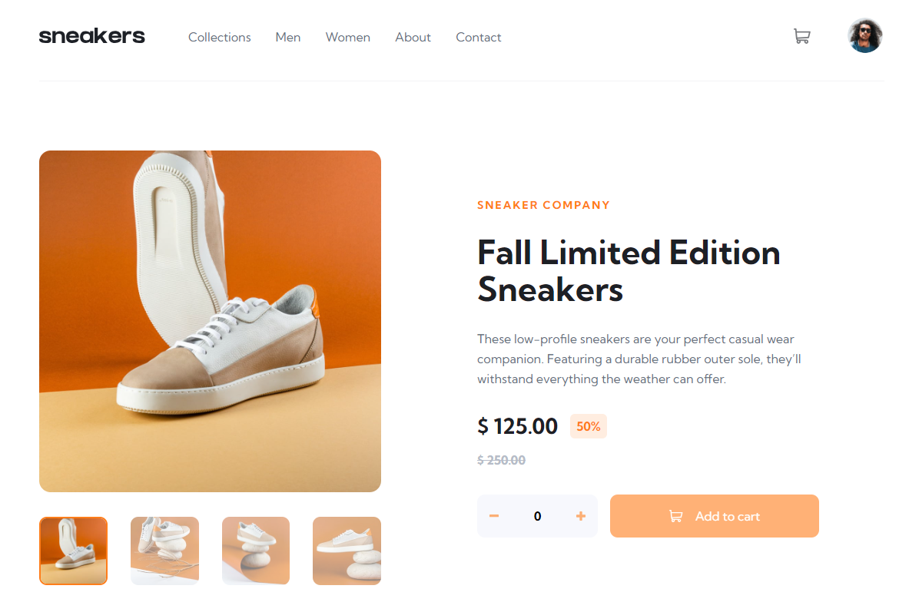

# Frontend Mentor - E-commerce product page solution

This is a solution to the [E-commerce product page challenge on Frontend Mentor](https://www.frontendmentor.io/challenges/ecommerce-product-page-UPsZ9MJp6). Frontend Mentor challenges help you improve your coding skills by building realistic projects.

## Table of contents

- [Overview](#overview)
  - [The challenge](#the-challenge)
  - [Screenshot](#screenshot)
  - [Links](#links)
- [My process](#my-process)
  - [Built with](#built-with)
  - [What I learned](#what-i-learned)
  - [Continued development](#continued-development)
- [Author](#author)

## Overview

### The challenge

Users should be able to:

- View the optimal layout for the site depending on their device's screen size
- See hover states for all interactive elements on the page
- Open a lightbox gallery by clicking on the large product image
- Switch the large product image by clicking on the small thumbnail images
- Add items to the cart
- View the cart and remove items from it

### Screenshot



### Links

- Solution URL: [https://github.com/maria-luiza-rodrigues-ti/ecommerce-product-page](https://github.com/maria-luiza-rodrigues-ti/ecommerce-product-page)
- Live Site URL: [https://ecommerce-product-page-inky-one.vercel.app](https://ecommerce-product-page-inky-one.vercel.app)

## My process

### Built with

- Semantic HTML5 markup
- CSS custom properties
- Flexbox
- CSS Grid
- Mobile-first workflow
- [TypeScript](https://www.typescriptlang.org) - JS Superset
- [Vite](https://vitejs.dev) - A project building tool
- [React](https://reactjs.org/) - JS library
- [Tailwind CSS](https://tailwindcss.com) - CSS framework
- [Radix UI](https://www.radix-ui.com) - Components Library
- [Phosphor Icons](https://phosphoricons.com) - Icons Library

### What I learned

The challenge pushed me to practice and improve my knowledge about the concept of state and properties in React, which are driving concepts of the framework.

State is a way of storing information that will be monitored by React, and the state can directly affect the rendering of components. All the states I used in the project were all local, using the useState hook.

Sharing information through component properties was a technique that allowed efficient communication between the parent component and the child components (Header, Minicart and Product Slider) within the application. Below are snippets of code where the technique was used:

```tsx
<Header onAddProductToCart={addProductToMinicart} />
```

```tsx
<ProductSlider onProductImages={handleProductSliderImages} />
```

```tsx
<Minicart onAddProductToCart={sendProductToMinicart} />
```

The challenge led me to explore these techniques in more depth, better understanding how changes in state affect the rendering of components and how properties facilitate the exchange of information between different parts of the application. This resulted in cleaner, more organized and easier to maintain code.


### Continued development

What I would like to improve in this project is the way the quantity of products is added to the cart. I believe there are more efficient and intuitive methods to deal with this.

## Author

- Frontend Mentor - [@maria-luiza-rodrigues-ti](https://www.frontendmentor.io/profile/maria-luiza-rodrigues-ti)

